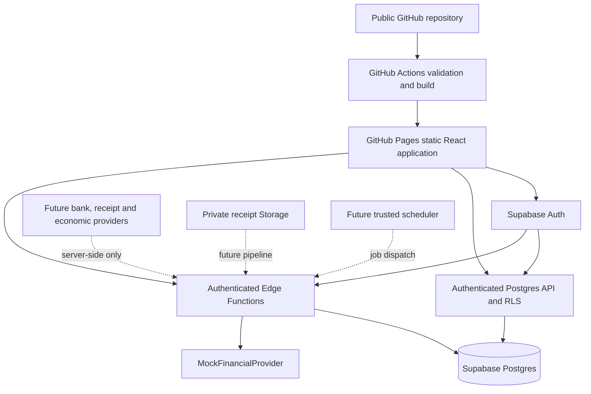

# Architecture

Clinic Finance is a static React application backed by Supabase. A public GitHub repository is the home for source code, reviews, issues, migrations, tests and releases. Pages hosts only the compiled browser application. The Pages deployment requires Supabase sign-in, and Postgres is the source of truth for its stored financial records.

## Runtime boundaries

The browser renders dashboards, chooses filters, signs users in and requests authorised operations. It may calculate deterministic display summaries from records that RLS has already authorised. It never holds a service-role key or makes privileged provider calls.

Supabase Auth identifies users through individual email-and-password accounts. Organisation membership and role determine access; RLS enforces it for browser reads. Protected RPCs handle supported user mutations. Financial ingestion uses trusted Edge Functions and server credentials. Composite tenant keys stop a row in one organisation from referring to another organisation's account or entity.

Source code and static assets remain publicly downloadable. Financial data access is enforced by Supabase rather than a password embedded in the frontend. Hosted Supabase Auth must disable public signup and provision only approved users. The signup interface appears only in development; this UI restriction does not replace the server setting.

The browser sends an access token to an Edge Function. The function validates identity and membership before using privileged database access. A service role bypasses RLS, so membership checks belong in every privileged operation, not just in the interface. Detailed policies and negative cases are documented in [security](security.md) and tested in the database suite.

GitHub Actions validates and deploys frontend assets. It has no banking or production database secrets. Version 0.1 does not automatically migrate a hosted database when frontend code changes; backend rollout is a distinct, explicit step.

## Data modes and deployment environments

| Mode                   | Data source                                     | Authentication         | Intended use                                                                         |
| ---------------------- | ----------------------------------------------- | ---------------------- | ------------------------------------------------------------------------------------ |
| `development/mock`     | Deterministic fictitious dataset in the browser | No backend session     | Immediate local UI development                                                       |
| `demo/mock`            | Same labelled fictitious dataset                | No backend session     | Local static preview and browser tests; never published by the Pages workflow        |
| `development/supabase` | Local Postgres via Auth/RLS and Edge Functions  | Local Supabase user    | Integration and access testing                                                       |
| `demo/supabase`        | Hosted Postgres via Auth/RLS and Edge Functions | Approved Supabase user | Authenticated hosted demo, built with Vite mode `hosted-demo`                        |
| `production/supabase`  | Hosted Postgres via Auth/RLS and Edge Functions | Supabase user          | Future production deployment, initially empty until authorised data ingestion exists |

Mock mode is a separate development adapter, not a database replacement. Supabase mode does not silently fall back to fictitious data on an error. The Pages workflow accepts only `DEPLOY_ENV=hosted-demo` (the default) or `production`. Both builds require an HTTPS Supabase endpoint and a public key, disallow frontend mock mode and exclude mock data from the frontend bundle. Backend demo provisioning separately requires a non-production environment, an explicit mock-data flag, matching database runtime settings and a demo organisation.

The selected hosted demo project is `clinic-finance-demo` (`gackqbplslckvdyijivb`) in Sydney. Its configuration is documented in [deployment](deployment.md); provisioning and verification of that hosted environment are distinct from local test results. Real financial data belongs in a separate production project with mock provisioning disabled.

## Domain model and calculations

An organisation owns business entities; an entity represents a clinic or the personal grouping. Entities own connections and accounts. Accounts own transactions. The interface initially presents three entities, but the model is not fixed to that number.

Amounts use signed integer AUD cents, with inflows positive and outflows negative. Posting dates use ISO calendar dates. A provider transaction identifier supports repeatable ingestion. The original provider payload is preserved separately from normalised records; categorisation and audit records add interpretation without rewriting source evidence.

Financial calculations are pure, deterministic code under `src/domain/`. Categories are a global catalogue while category choices belong to an organisation's transactions. Rules set initial categories; manual decisions must survive later processing. Internal-transfer detection matches compatible opposite movements across owned accounts and excludes recognised transfers from income and expense summaries. Matching is a conservative foundation, not bank reconciliation.

Cash movement is not accrual profit. Loan principal, credit-card payments and tax transfers need distinct treatment as accounting capabilities grow. Version 0.1 does not infer GST liabilities or treat an expense-category total as a tax return.

## Static hosting and routing

Vite outputs HTML, CSS and JavaScript into `dist/`. There is no Node server, SSR or API route hosted on Pages. Hash-based routes put the application route after `#`, so refreshing `https://OWNER.github.io/clinic-finance/#/transactions` requests the existing static index. `VITE_BASE_PATH` controls asset URLs independently of routes. It is `/clinic-finance/` for a project site and `/` for a domain root.

Authentication uses Supabase in the browser. The sign-in gate protects workspace routes, including deep links and reloads. Auth site URLs and allowed redirects must match each deployed origin and base path; the selected site is `https://ziliangli2018-cyber.github.io/clinic-finance/`. Edge Function CORS settings use the origin alone, `https://ziliangli2018-cyber.github.io`. Provider credentials and authorisation codes for future banking integrations terminate at backend endpoints, never at an arbitrary Pages route.

## Banking pipeline

The provider interface covers connect, refresh, account retrieval, balances, transactions and disconnect. Version 0.1 implements the mock adapter. A Basiq adapter remains disabled until its consent lifecycle, credential storage, error handling, retries and provider-specific mapping exist.

The trusted pipeline checks the caller, checks tenant access, obtains provider data, preserves raw input, normalises values, upserts accounts and transactions, categorises, attempts transfer matching and records a result. Provider identifiers and unique constraints establish ingestion idempotency. See [banking integration](banking-integration.md) for the exact implemented behaviour and remaining steps.

## Future server-side modules

Scheduled sync must run when no browser is open. A trusted scheduler will dispatch durable jobs containing organisation and connection IDs. Workers will claim jobs, enforce idempotency, use bounded retries and record completion or failure. Credentials stay in Supabase secrets or a backend vault. GitHub Actions may run public, non-sensitive maintenance jobs; private financial sync belongs in the backend.

Receipts will pass from an authenticated upload, email or camera source into private Storage, then through extraction, normalisation and candidate transaction matching. Workers will preserve provenance, confidence and a human review state. Version 0.1 has foundations and explicit placeholders, not a working upload/OCR pipeline.

Economic adapters will expose series, latest values, historical observations and refresh. Postgres observations need provider IDs, units, periods, publication timestamps and revision history. Inflation-adjusted analytics must state the selected index and base period. No live RBA, ABS or market-data fetching runs in Version 0.1.

The future AI layer will call approved, organisation-scoped analytics functions and explain their structured results with dates and provenance. Deterministic SQL or application code will calculate financial values. An LLM will not create authoritative ledger entries or run arbitrary SQL supplied by a user.
