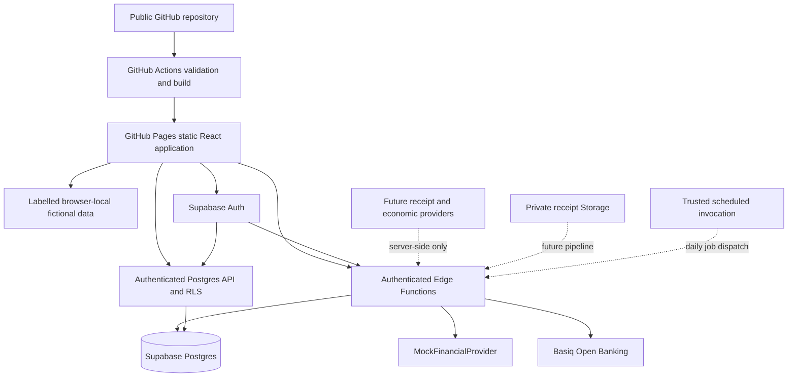

# Architecture

Clinic Finance is a static React application with a browser-only public demo and a separately activated Supabase-backed deployment. A public GitHub repository is the home for source code, reviews, issues, migrations, tests and releases. Pages hosts only the compiled browser application. Hosted and production deployments require Supabase sign-in, and Postgres is the source of truth for their stored financial records.

```mermaid
flowchart TD
  Repo[Public GitHub repository] --> CI[GitHub Actions validation and build]
  CI --> Pages[GitHub Pages static React application]
  Pages --> PublicDemo[Labelled browser-local fictional data]
  Pages --> Auth[Supabase Auth]
  Pages --> RLS[Authenticated Postgres API and RLS]
  Pages --> Edge[Authenticated Edge Functions]
  Auth --> RLS
  Auth --> Edge
  Edge --> DB[(Supabase Postgres)]
  RLS --> DB
  Edge --> Mock[MockFinancialProvider]
  Edge --> Basiq[Basiq Open Banking]
  Future[Future receipt and economic providers] -. server-side only .-> Edge
  Storage[Private receipt Storage] -. future pipeline .-> Edge
  Scheduler[Trusted scheduled invocation] -. daily job dispatch .-> Edge
```

## Runtime boundaries

The browser renders dashboards, chooses filters, signs users in and requests authorised operations. It may calculate deterministic display summaries from records that RLS has already authorised. It never holds a service-role key or makes privileged provider calls.

Supabase Auth identifies users through individual email-and-password accounts. Organisation membership and role determine access; RLS enforces it for browser reads. Protected RPCs handle supported user mutations. Financial ingestion uses trusted Edge Functions and server credentials. Composite tenant keys stop a row in one organisation from referring to another organisation's account or entity.

Source code and static assets remain publicly downloadable. Financial data access is enforced by Supabase rather than a password embedded in the frontend. Hosted Supabase Auth must disable public signup and provision only approved users. The signup interface appears only in development; this UI restriction does not replace the server setting.

The browser sends an access token to an Edge Function. The function validates identity and membership before using privileged database access. A service role bypasses RLS, so membership checks belong in every privileged operation, not just in the interface. Detailed policies and negative cases are documented in [security](security.md) and tested in the database suite.

GitHub Actions validates and deploys frontend assets. It has no banking or production database secrets. Version 0.3 does not automatically migrate a hosted database when frontend code changes; backend rollout is a distinct, explicit step.

## Data modes and deployment environments

| Mode                   | Data source                                     | Authentication         | Intended use                                                                            |
| ---------------------- | ----------------------------------------------- | ---------------------- | --------------------------------------------------------------------------------------- |
| `development/mock`     | Deterministic fictitious dataset in the browser | No backend session     | Immediate local UI development                                                          |
| `demo/mock`            | Same labelled fictitious dataset                | No backend session     | Default public Pages demo, local static preview and browser tests                       |
| `development/supabase` | Local Postgres via Auth/RLS and Edge Functions  | Local Supabase user    | Integration and access testing                                                          |
| `demo/supabase`        | Hosted Postgres via Auth/RLS and Edge Functions | Approved Supabase user | Authenticated hosted demo, built with Vite mode `hosted-demo`                           |
| `production/supabase`  | Hosted Postgres via Auth/RLS and Edge Functions | Supabase user          | Separately activated production deployment; empty until approved onboarding and consent |

Mock mode is a separate development adapter, not a database replacement. Supabase mode does not silently fall back to fictitious data on an error. The Pages workflow publishes `public-demo` by default and allows an explicit manual selection of `hosted-demo` or `production`. The latter two builds require an HTTPS Supabase endpoint and a public key, disallow frontend mock mode and exclude mock data from the frontend bundle. Backend demo provisioning separately requires a non-production environment, an explicit mock-data flag, matching database runtime settings and a demo organisation.

The selected hosted demo project is `clinic-finance-demo` (`gackqbplslckvdyijivb`) in Sydney. Its configuration is documented in [deployment](deployment.md); provisioning and verification of that hosted environment are distinct from local test results. Real financial data belongs in a separate production project with mock provisioning disabled.

## Domain model and calculations

An organisation owns business entities. The demo presents Kilcoy, Burpengary, Group finance and Personal; a live workspace starts with the first three. A bank connection belongs to the organisation/group boundary, while each account can be independently assigned to a clinic or Group finance. Accounts own transactions.

Amounts use signed integer AUD cents, with inflows positive and outflows negative. Posting dates use ISO calendar dates. A provider transaction identifier supports repeatable ingestion. The mock pipeline retains invented provider evidence for testing; the Basiq path deliberately persists only validated normalised fields and private provider identifiers. Categorisation and audit records add interpretation without rewriting provider facts.

Financial calculations are pure, deterministic code under `src/domain/`. Categories are a global catalogue while category choices belong to an organisation's transactions. Rules set initial categories; manual decisions must survive later processing. Internal-transfer detection matches compatible opposite movements across owned accounts and excludes recognised transfers from income and expense summaries. Matching is a conservative foundation, not bank reconciliation.

Cash movement is not accrual profit. Loan principal, credit-card payments and tax transfers need distinct treatment as accounting capabilities grow. Version 0.3 does not infer GST liabilities or treat an expense-category total as a tax return.

## Static hosting and routing

Vite outputs HTML, CSS and JavaScript into `dist/`. There is no Node server, SSR or API route hosted on Pages. Hash-based routes put the application route after `#`, so refreshing `https://OWNER.github.io/clinic-finance/#/transactions` requests the existing static index. `VITE_BASE_PATH` controls asset URLs independently of routes. It is `/clinic-finance/` for a project site and `/` for a domain root.

Authentication uses Supabase in the browser. The sign-in gate protects workspace routes, including deep links and reloads. Auth site URLs and allowed redirects must match each deployed origin and base path; the selected site is `https://ziliangli2018-cyber.github.io/clinic-finance/`. Edge Function CORS settings use the origin alone, `https://ziliangli2018-cyber.github.io`. Provider credentials and short-lived consent tokens terminate at backend endpoints or Basiq's exact consent origin, never at an arbitrary Pages route.

## Banking pipeline

The mock provider remains available only behind demo gates. Version 0.3 adds a separate production Basiq v3 adapter covering business-user creation, hosted consent, multiple Open Banking connections, refresh jobs, NAB/BOQ Specialist normalisation, consent status and disconnection. It remains disabled until every production configuration and provider-approval gate passes.

The trusted pipeline checks the caller, checks tenant access, obtains provider data, validates institution/connection/account scope, normalises values and atomically upserts accounts and transactions. Provider identifiers and unique constraints establish ingestion idempotency. Manual clinic assignments and categories survive provider refreshes. See [banking integration](banking-integration.md) for the exact boundaries.

## Future server-side modules

`bank-sync-scheduled` runs independently of browser sessions, reads every private banking profile through a service-only RPC, imports cached provider data and purges records after lost consent. An operator must configure the daily Supabase/Vault-backed invocation and alerting. Credentials stay in Supabase secrets or a backend vault; private financial sync never runs in GitHub Pages.

Receipts will pass from an authenticated upload, email or camera source into private Storage, then through extraction, normalisation and candidate transaction matching. Workers will preserve provenance, confidence and a human review state. Version 0.3 has foundations and explicit placeholders, not a working upload/OCR pipeline.

Economic adapters will expose series, latest values, historical observations and refresh. Postgres observations need provider IDs, units, periods, publication timestamps and revision history. Inflation-adjusted analytics must state the selected index and base period. No live RBA, ABS or market-data fetching runs in Version 0.3.

The future AI layer will call approved, organisation-scoped analytics functions and explain their structured results with dates and provenance. Deterministic SQL or application code will calculate financial values. An LLM will not create authoritative ledger entries or run arbitrary SQL supplied by a user.
